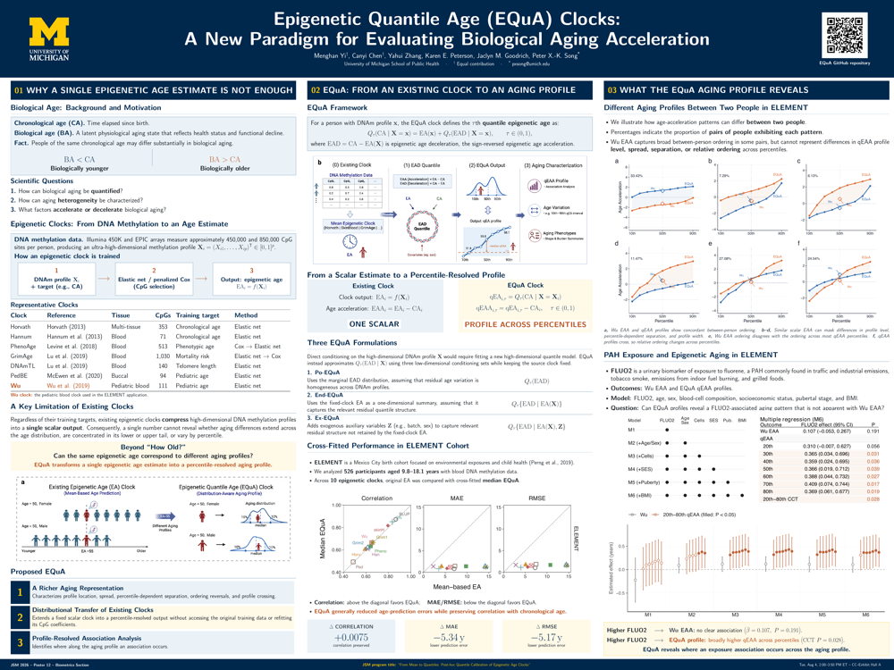

---
output:
  github_document:
    html_preview: false
---

```{r setup, include=FALSE}
knitr::opts_chunk$set(
  collapse = TRUE,
  comment = "#>",
  fig.path = "man/figures/README-"
)
```

# EQuA

EQuA is a distributional framework that extends a scalar age estimate into an
individual percentile-resolved aging profile. In epigenetic-clock
applications, the resulting quantities are termed quantile epigenetic age
(qEA) and quantile epigenetic age acceleration (qEAA).

The framework extends an existing age estimator without refitting the source
model. Although developed in the context of epigenetic clocks, it can also be
applied whenever chronological age and an existing estimated age are available.

> **Development version**
>
> This repository contains the reference implementation in R of the EQuA
> framework accompanying our JSM 2026 poster. The current version includes
> Po-EQuA, kernel implementations of End-EQuA and Ex-EQuA, prediction for new
> observations, and repeated cross-fitting. The interface may continue to
> evolve during manuscript preparation.

## JSM 2026 poster

**Epigenetic Quantile Age (EQuA) Clocks:<br>
A New Paradigm for Evaluating Biological Aging Acceleration**

Presented at the 2026 Joint Statistical Meetings in Boston, Massachusetts.

- [View the full-resolution poster](poster/EQuA_JSM2026_Poster.pdf)
- JSM program title: *From Mean to Quantiles: Post-hoc Quantile Calibration
  of Epigenetic Age Clocks*

[](poster/EQuA_JSM2026_Poster.pdf)

## Installation

Install the development version from GitHub:

```{r install, eval=FALSE}
# install.packages("remotes")
remotes::install_github("Menghan898/EQuA")
```

## Minimal workflow

```{r minimal-workflow}
library(EQuA)

dat <- EQuA::simulated_equa_data
calibration <- subset(dat, sample_role == "calibration")
application <- subset(dat, sample_role == "application")

fit <- fit_equa(
  chronological_age = calibration$chronological_age,
  estimated_age = calibration$estimated_age,
  method = "kernel_end",
  probs = seq(0.1, 0.9, by = 0.1)
)

profile <- predict(
  fit,
  new_estimated_age = application$estimated_age,
  chronological_age = application$chronological_age
)

summary(profile)
plot(profile, rows = 1:6)
```

Repeated cross-fitting produces strictly out-of-fold profiles. A small number
of repeats is used here to keep the example quick; a research analysis can
request more.

```{r crossfit-workflow}
profile_cf <- crossfit_equa(
  chronological_age = calibration$chronological_age,
  estimated_age = calibration$estimated_age,
  method = "kernel_end",
  folds = 5,
  repeats = 3,
  seed = 2026,
  keep_repeats = FALSE
)

summary(profile_cf)
```

## Supported methods

Let \(\mathrm{EAD}=\mathrm{CA}-\mathrm{EA}\) denote estimated-age
deceleration.

| Method | Conditional EAD distribution |
|:--|:--|
| Po-EQuA | \(Q_\tau(\mathrm{EAD})\) |
| End-EQuA | \(Q_\tau(\mathrm{EAD}\mid\mathrm{EA})\) |
| Ex-EQuA | \(Q_\tau(\mathrm{EAD}\mid\mathrm{EA}, Z)\) |

See the
[statistical method specification](vignettes/method-specification.Rmd)
for formal definitions and implementation conventions.

## Scope

The current development release supports:

- Po-EQuA, kernel End-EQuA, and kernel Ex-EQuA;
- calibration-sample fitting and prediction for new observations;
- repeated K-fold cross-fitting;
- qEA and qEAA profile summaries and visualization.

The package does not calculate DNA methylation clocks or process raw
methylation data. Users provide chronological age and an existing
estimated age.

## Included public examples

Two compact public datasets are included as ready-to-use examples:
`gse40279_equa` and `gse50660_equa`. Each dataset contains a public GSM
accession, chronological age, and a precomputed Horvath v1 epigenetic-age
estimate.

| Dataset | Samples | Age range (years) | Estimated age |
|:--|--:|:--:|:--|
| GSE40279 | 656 | 19–101 | Horvath v1 |
| GSE50660 | 464 | 38–67 | Horvath v1 |

```{r public-geo}
geo <- EQuA::gse40279_equa
dim(geo)
head(geo)
```

These datasets are provided as CA/EA inputs for demonstrating the EQuA
workflow; they do not contain methylation matrices or clock-calculation
inputs. See the [data provenance](development/data-provenance.md) and
[data quality review](development/geo-example-data-quality.md) for processing
details, CpG coverage, checksums, exclusions, and limitations.

## Privacy

EQuA fitted objects may retain participant-level calibration values needed for
prediction. Do not publish or share fitted objects created from restricted data
without an appropriate disclosure review. See the
[method specification](vignettes/method-specification.Rmd#data-privacy-and-fitted-objects)
for the implemented safeguards and remaining user responsibilities.

## Project documentation

- [Data provenance](development/data-provenance.md)
- [Public GEO data quality review](development/geo-example-data-quality.md)
- [Poster information](poster/README.md)

## Citation

Run the following command to obtain the recommended software citation:

```{r citation, eval=FALSE}
citation("EQuA")
```

Citation metadata are also provided in [`CITATION.cff`](CITATION.cff). A
separate citation is included for the JSM 2026 poster.

## License

EQuA is released under the [MIT License](LICENSE.md).
