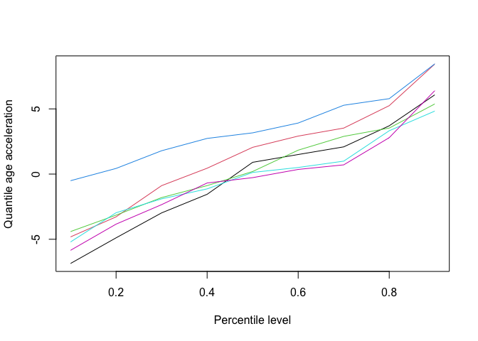

# EQuA

EQuA is a distributional framework that transforms a single estimated
age into an individual percentile-resolved aging profile, represented
through quantile age (qEA) and quantile age acceleration (qEAA).

The framework extends an existing age estimator without refitting the
source model. Although developed in the context of epigenetic clocks, it
can be applied whenever chronological age and an existing estimated age
are available.

> **Development version**
>
> This repository contains the pure-R reference implementation of the
> EQuA framework accompanying our JSM 2026 poster. Po-EQuA, Kernel
> End-EQuA, Kernel Ex-EQuA, prediction, and repeated cross-fitting are
> implemented and tested. The interface may still evolve during
> manuscript preparation.

## JSM 2026 poster

**Epigenetic Quantile Age (EQuA) Clocks:<br> A New Paradigm for
Evaluating Biological Aging Acceleration**

Presented at the 2026 Joint Statistical Meetings in Boston,
Massachusetts.

- [View the full-resolution
  poster](https://github.com/Menghan898/EQuA/blob/main/poster/EQuA_JSM2026_Poster.pdf)
- JSM program title: *From Mean to Quantiles: Post-hoc Quantile
  Calibration of Epigenetic Age Clocks*

[](https://github.com/Menghan898/EQuA/blob/main/poster/EQuA_JSM2026_Poster.pdf)

The poster URL above is intentionally absolute and stable because the
repository address is encoded in the poster QR code.

## Installation

After the local development version is published to this repository,
install it with:

``` r
install.packages("remotes")
remotes::install_github("Menghan898/EQuA")
```

## Minimal workflow

``` r
library(EQuA)

dat <- EQuA::simulated_equa_data
calibration <- subset(dat, sample_role == "calibration")
application <- subset(dat, sample_role == "application")

fit <- fit_equa(
  chronological_age = calibration$chronological_age,
  estimated_age = calibration$estimated_age,
  method = "kernel_end",
  probs = seq(0.1, 0.9, by = 0.1)
)

profile <- predict(
  fit,
  new_estimated_age = application$estimated_age,
  chronological_age = application$chronological_age
)

summary(profile)
#> EQuA profile summary
#>   Object class:       equa_profile
#>   Method:             kernel_end
#>   Observations:       40
#>   qEA available:      40
#>   qEAA available:     40
#>   Low-support rows:   0
#>   Outside-range rows: 3
#>   Incomplete rows:    0
plot(profile, rows = 1:6)
```

<!-- -->

Repeated cross-fitting produces strictly out-of-fold profiles. A small
number of repeats is used here to keep the example quick; a research
analysis can request more.

``` r
profile_cf <- crossfit_equa(
  chronological_age = calibration$chronological_age,
  estimated_age = calibration$estimated_age,
  method = "kernel_end",
  folds = 5,
  repeats = 3,
  seed = 2026,
  keep_repeats = FALSE
)

summary(profile_cf)
#> EQuA profile summary
#>   Object class:       equa_crossfit
#>   Method:             kernel_end
#>   Observations:       200
#>   qEA available:      200
#>   qEAA available:     200
#>   Low-support rows:   0
#>   Outside-range rows: 3
#>   Incomplete rows:    0
```

## Public GEO examples

Two complete but compact public-data inputs are included:
`gse40279_equa` (656 samples) and `gse50660_equa` (464 samples). Each
contains only a public GSM accession, chronological age, and an upstream
Horvath v1 estimated age.

| Dataset | Samples | Age range (years) | Required/matched CpGs | Coverage/missing (%) | EA output |
|:---|---:|:---|:---|:---|:---|
| GSE40279 | 656 | 19–101 | 353/353 | 100.0/0.0 | Yes |
| GSE50660 | 464 | 38–67 | 353/351 | 99.4/0.6 | Yes |

“EA output” means that a finite Horvath v1 `estimated_age` is present
for every retained sample; it does not imply complete CpG coverage.

``` r
geo <- EQuA::gse40279_equa
dim(geo)
#> [1] 656   3
head(geo)
#>   sample_id chronological_age estimated_age
#> 1 GSM989827                67      52.16114
#> 2 GSM989828                89      75.44622
#> 3 GSM989829                66      62.60288
#> 4 GSM989830                64      54.24967
#> 5 GSM989831                62      62.94723
#> 6 GSM989832                87      76.98666
```

These are ready-to-use CA/EA inputs, not methylation matrices or clock
calculation data. GSE50660 used 351 of the 353 Horvath model CpGs; the
missing CpGs were not filled by cohort-mean or K-nearest-neighbor
imputation. See the [data provenance](development/data-provenance.md)
and [data quality review](development/geo-example-data-quality.md) for
the original publications, exact processing, checksums, exclusions, and
limitations.

## Supported methods

| Method   | Conditional EAD distribution             |
|:---------|:-----------------------------------------|
| Po-EQuA  | $Q_\tau(\mathrm{EAD})$                   |
| End-EQuA | $Q_\tau(\mathrm{EAD}\mid\mathrm{EA})$    |
| Ex-EQuA  | $Q_\tau(\mathrm{EAD}\mid\mathrm{EA}, Z)$ |

See the [statistical method
specification](vignettes/method-specification.Rmd) for formal
definitions and implementation conventions.

## Scope

The current development release supports:

- Po-EQuA, kernel End-EQuA, and kernel Ex-EQuA;
- calibration-sample fitting and prediction for new observations;
- repeated K-fold cross-fitting;
- qEA and qEAA profile summaries and visualization.

The package does not calculate DNA methylation clocks or process raw
methylation data. Users provide chronological age and an existing
estimated age.

## Privacy

Kernel EQuA fit objects may retain participant-level calibration values
needed for later prediction. Do not publish or share fitted objects
created from restricted data without an appropriate disclosure review.
See the [method
specification](vignettes/method-specification.Rmd#data-privacy-and-fitted-objects)
for the implemented safeguards and remaining user responsibilities.

## Project documentation

- [Data provenance](development/data-provenance.md)
- [Public GEO data quality
  review](development/geo-example-data-quality.md)
- [Poster information](poster/README.md)

## Citation

Citation metadata are provided in `CITATION.cff` for GitHub and
`inst/CITATION` for R. EQuA is released under the [MIT
License](LICENSE.md). The initial development release credits Menghan Yi
as the software author and maintainer (`menghany@umich.edu`). The
separate poster citation retains the full poster author list.
